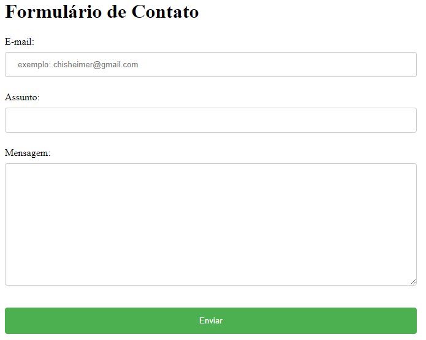

# FORMULÁRIO DE CONTATO

## 🚀 Começando
Nesse projeto, criamos um index sobre Formulário de Contato na matéria de:
* Fundamentos de Desenvolvimento Web.

## 📋 Sobre o projeto
Projeto criado de exemplo para termos uma noção de como criarmos um espaço para contato em sites.
###  Exemplo
* Houve alguma dúvida usando o site? Utilize o nosso Espaço para Contato para tirar sua dúvida.

## 📁 Documentação do index.html 
* [form](https://developer.mozilla.org/pt-BR/docs/Learn/Forms/Your_first_form): O elemento HTML &lt;form&gt; representa uma seção de documento que contém controles interativos para enviar informações.
* label: O elemento HTML &lt;label&gt; representa uma legenda para um item em uma interface do usuário. Ele pode estar associado com um elemento de controle, colocando este dentro do elemento label, ou usando o atributo for. Tal controle é chamado de Controle etiquetado ou Elemento etiqueta.
* for:  É o atributo de entrada para qual o &lt;label&gt; se destina. Seu valor deve ser igual ao valor do atributo id do elemento controle de entrada (&lt;input&gt;).
* input: O elemento HTML &lt;input&gt; é usado para criar controles interativos para formulários baseados na web para aceitar dados do usuário. O elemento é um dos mais poderosos e complexos de todo HTML devido ao grande número de combinações de tipos de entrada e atributos.
* type: O type é usado para especificar o tipo de conteúdo que essa tag link está importando, o valor do atributo deve ser um MIME type como "text/html", "text/css" e assim por diante.
* name: O name é um atributo muito importante para os campos do tipo input. Ele serve para identificar o valor daquela variável no nosso backend(código que conecta a internet com o banco de dados, gerencia as conexões dos usuários e alimenta a aplicação web.)
* span: O elemento HTML é um contêiner embutido para expressar conteúdo, que não representa nada inerentemente. Ele pode ser usado para agrupar elementos para fins de estilo ou porque eles compartilham valores de atributos. Deve ser usado somente quando nenhum outro elemento semântico for apropriado. É muito parecido com um elemento, mas é um elemento de nível de bloco.
* id: O atributo id especifica uma identificação única para o elemento HTML. Por questões de boas práticas, não deve ser reutilizado e nem conter espaços em seu nome, pois o navegador irá identificar o espaço como parte dele, já que os elementos não podem ter mais de um id.
* textarea: O elemento HTML &lt;textarea&gt; representa um controle de edição de texto simples de múltiplas linhas, útil quando você deseja permitir que os usuários insiram uma quantidade considerável de texto de formato livre, por exemplo, um comentário em um formulário de revisão ou feedback.
* button: O elemento HTML é um elemento interativo ativado por um usuário com mouse, teclado, dedo, comando de voz ou outra tecnologia assistiva. Uma vez ativado, ele executa uma ação, como enviar um formulário ou abrir uma caixa de diálogo.

##  📁Documentação do formulario.css
* width:A propriedade CSS width define a largura de um elemento. Por padrão, ele define a largura da área de conteúdo , mas se estiver definido como border-box, define a largura da área da borda.
* padding:A propriedade CSS padding define a área de preenchimento em todos os quatro lados de um elemento de uma só vez.
* margin: A propriedade margin do CSS define a área de margem nos quatro lados do elemento. É uma abreviação que define todas as margens individuais de uma só vez: margin-top, margin-right, margin-bottom, e margin-left.
* display:A propriedade display CSS define se um elemento que é tratado como um bloco ou elemento inline e o layout usado. Formalmente, a propriedade display define os tipos de exibição internos e externos de um elemento. O tipo externo define a participação de um elemento no layout de fluxo; o tipo interno define o layout. Alguns valores de display são totalmente definidos em suas próprias especificações individuais.
* border: A border é especialmente útil quando você deseja que todas as quatro bordas sejam iguais. Para torná-las diferentes entre si, no entanto, você pode usar as propriedades longhand border-width, border-stylee border-color, que aceitam valores diferentes para cada lado.
* border-radius: A propriedade CSS arredonda os cantos da borda externa de um elemento. Você pode definir um único raio para criar cantos circulares ou dois raios para criar cantos elípticos.
* box-sizing: A propriedade CSS define como a largura e altura totais de um elemento são calculadas. A box-sizing pode ser usada para ajustar os seguintes comportamentos: content-box e border-box.
* background-color:  background-colorpropriedade define a cor de fundo de um elemento. O plano de fundo de um elemento é o tamanho total do elemento, incluindo preenchimento e borda (mas não a margem).
* color: A propriedade color do CSS define o valor da cor de um elemento com seu conteúdo em texto e suas decorações (estilos).
* cursor: A propriedade CSS define o cursor do mouse, se houver, para mostrar quando o ponteiro do mouse está sobre um elemento. A configuração do cursor deve informar os usuários sobre as operações do mouse que podem ser executadas no local atual, incluindo: seleção de texto, ativação de menus de ajuda ou de contexto, cópia de conteúdo, redimensionamento de tabelas e assim por diante.

## 🔨Técnicas e Tecnologias utilizadas
* Visual Studio Code 
* Git Bash
* Git Hub
* HTML5
* CSS3
* Live Server (Live Server é uma extensão do Visual Studio Code que ajuda a visualizar a atividade antes de fazer o commit.)

## 🚧 Fontes utilizadas
* [Mozilla](https://developer.mozilla.org/en-US/docs/Web/HTML/Element/form)- The Form Element.
* [Alura](https://www.alura.com.br/artigos/escrever-bom-readme)- Como Escrever um README Incrível no seu GitHub.

## ✍🏻Autores
| [ Larissa Gabrielle Fagundes Andrade.](https://github.com/gabriellefagundes) |
| :---: 